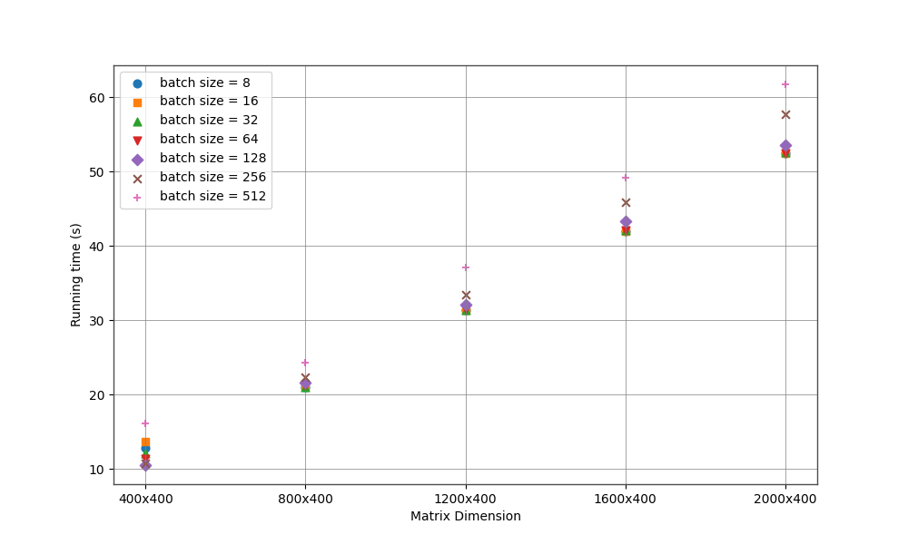

# LLMs-Inference

# Date: 10.09.2024

## Dataset
We choose validation set, test set and partial train set of wikitext-103-v1 to construct a dataset with 3759072 tokens.

## Test Model

### GPT2
| Model Type                       | Params  | n_layer | n_head   | n_embd   | model_size  | QKV_dimension  |
|----------------------------------|---------|---------|----------|----------|-------------|----------------|
| gpt2                             | 124M    | 12      | 12       | 768      |0.46 GB      |(B, 12, T, 64)  |
| gpt2-medium                      | 350M    | 24      | 16       | 1024     |1.30 GB      |(B, 16, T, 64)  |
| gpt2-large                       | 774M    | 36      | 20       | 1280     |2.88 GB      |(B, 20, T, 64)  |
| gpt2-xl                          | 1158M   | 48      | 25       | 1600     |4.32 GB      |(B, 25, T, 64)  |

## Results

### Running Time (s)

#### Fix Sequence Length (T)
We fixed the sequence length T to 1024, while changing mode types and batch sizes. The following image shows the relationship between running time in second and batch size for a given model type.


#### Fix Batch Size (B) and Model Type
We fixed the batch size B to 32 and model type to GPT2, while changing the sequence length. The following image shows the relationship between running time in second and the sequence length.


#### Fix Batch Size (B), Model Type, Sequence Length (T)
We fixed the batch size B to 4,  model type to GPT2 and the sequence length to 1024, while changing the n_group. Here n_groups means how many heads share a same k and v. The following image shows the relationship between running time in second and n_group.


### Peak Memory (GB)

#### Fix Sequence Length (T)
We fixed the sequence length T to 1024, while changing mode types and batch sizes. The following image shows the relationship between peak memory in GB and batch size for a given model type.


#### Fix Batch Size (B) and Model Type
We fixed the batch size B to 32 and model type to GPT2, while changing the sequence length. The following image shows the relationship between peak memory in GB and the sequence length.


#### Fix Batch Size (B), Model Type, Sequence Length (T)
We fixed the batch size B to 4,  model type to GPT2 and the sequence length to 1024, while changing the n_groups. Here n_groups means how many heads share a same k and v. Here n_groups means how many heads share a same k and v. The following image shows the relationship peak memory in GB and n_group.


## Conclusion

> Peak Memory:
- GPU memory costs seem to linearly increase as batch size and sequence length.
- GPU memory costs increase as the model size increase.
- GPU memory costs reduce when n_group increases, but it is not very huge as expected

> Running Time:
- Running time increase as model size increases, but this phenomenon is not clear when batch size increases.
- Increasing batch size from 4 to 32 reduces running time in all types of model, but not very obvious.
- Running time increase as sequence length increases.
- Running time reduce when n_group increases, but it is not very huge as expected

## Discussion and Next Steps

-From this test, it seems that larger batch size may help reduce the running time but not obvious.
-A large n_group does not lead to much GPU memory costs and running time reduction as paper claimed. The reason behind it might we do not use
kv caching, so benefits from reducing kv dimension is not apparent.


# Date: 24.08.2024

## Dataset
The tree structure of dataset is as follows:
```bash
dataset
├── 1200-400
│   ├── key
│   ├── query
│   └── value
├── 1600-400
│   ├── key
│   ├── query
│   └── value
├── 2000-400
│   ├── key
│   ├── query
│   └── value
├── 400-400
│   ├── key
│   ├── query
│   └── value
└── 800-400
    ├── key
    ├── query
    └── value
```
The dataset contains five folders, each of which stores 3*2000 matrices of a given size as indicated by the folder's name. Considering that the length of tokens is usually larger than the length of embeddings, we generated these matrices with more rows than columns. The dataset is too large to upload to GitHub, but you can use `utils/data.py` to generate this dataset, where values are stored as `Float32`. Please place the dataset under the root path before running a test.

## Matrix Multiplication
Currently, our test is based on a [Scaled Dot-Product Attention](https://example.com)
```math
\text{Attention}(Q, K, V) = \text{softmax}\left(\frac{QK^T}{\sqrt{d_k}}\right)V
```
## Test Platform
GN10Xp.2XLARGE4 (1 * NVIDIA V100)

## Results

### Peak Memory (GB)

#### Statistics
| Size                     | 400x400 | 800x400 | 1200x400 | 1600x400 | 2000x400 |
|--------------------------|---------|---------|----------|----------|----------|
| 8                        | 0.02    | 0.07    | 0.13     | 0.21     | 0.31     |
| 16                       | 0.05    | 0.14    | 0.26     | 0.42     | 0.62     |
| 32                       | 0.10    | 0.27    | 0.52     | 0.84     | 1.24     |
| 64                       | 0.20    | 0.53    | 1.03     | 1.68     | 2.48     |
| 128                      | 0.38    | 1.07    | 2.06     | 3.36     | 4.96     |
| 256                      | 0.76    | 2.14    | 4.12     | 6.72     | 9.92     |
| 512                      | 1.53    | 4.28    | 8.24     | 13.43    | 19.84    |

#### Fix Matrix Size
We fixed the size of queries, keys and values, while changing batch size from 8 to 512. The following image shows the relationship between memory in GB with batch size, given a fixed size of queries, keys and values


#### Fix Batch Size
We fixed the batch size, while changing matrix (query, value, key) size from 400x400 to 2000x400. The following image shows the relationship between memory in GB with matrix size, given a fixed batch size


### Running Time (s)

#### Statistics
| Size                     | 400x400 | 800x400 | 1200x400 | 1600x400 | 2000x400 |
|--------------------------|---------|---------|----------|----------|----------|
| 8                        | 12.85   | 21.00   | 31.43    | 41.97    | 52.43    |
| 16                       | 13.66   | 21.09   | 31.39    | 41.97    | 52.46    |
| 32                       | 12.15   | 21.06   | 31.42    | 42.14    | 52.66    |
| 64                       | 11.38   | 21.31   | 31.55    | 42.11    | 52.45    |
| 128                      | 10.54   | 21.59   | 32.08    | 43.28    | 53.64    |
| 256                      | 10.82   | 22.32   | 33.48    | 45.92    | 57.77    |
| 512                      | 16.14   | 24.27   | 37.13    | 49.20    | 61.75    |

#### Fix Matrix Size
We fixed the size of queries, keys and values, while changing batch size from 8 to 512. The following image shows the relationship between running time in second with batch size, given a fixed size of queries, keys and values


#### Fix Batch Size
We fixed the batch size, while changing matrix (query, value, key) size from 400x400 to 2000x400. The following image shows the relationship between running time in second with matrix size, given a fixed batch size



## Conclusion

> Peak Memory:
- GPU memory costs seem to linearly increase as batch size increases or matrix size increases.

> Running Time:
- Running time seems to linearly increase as matrix size increases, but this phenomenon does not hold true when batch size increases.
- Increasing batch size from 8 to 32 may help efficiency, such as with matrix sizes of 400x400 and 1200x400, but the benefit is minimal.
- When the batch size increases to 512, time costs are always the largest among all matrix sizes.

> Possible Reasons Why Larger Batch Size Does Not Help:
- Large batch size increases the overhead of dataloader initialization.
- I/O costs are the dominant bottleneck in our test since a Scaled Dot-Product Attention is quite simple and only consumes few resources. The benefits of large batch sizes, such as high GPU utilization, cannot offset the large overheads.

> Possible Solutions:
- Increase the costs of scaled dot-product attention by increasing the matrix size, perhaps from 400x2000 to 1000x5000, but be cautious about memory usage.
- Adopt more complex operations on matrices, for example, loading a model.
- Increase the number of matrices, for example from 2000 to 10000, to compensate for the large overheads caused by dataloader initialization.


