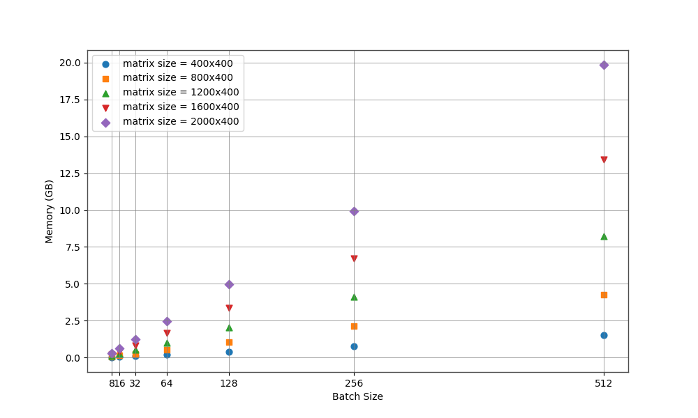

# LLMs-Inference

## Dataset
The tree structure of dataset is as follows:
```bash
dataset
├── 1200-400
│   ├── key
│   ├── query
│   └── value
├── 1600-400
│   ├── key
│   ├── query
│   └── value
├── 2000-400
│   ├── key
│   ├── query
│   └── value
├── 400-400
│   ├── key
│   ├── query
│   └── value
└── 800-400
    ├── key
    ├── query
    └── value
```
The dataset contains five folders, each of which stores 3*2000 matrices of a given size indicating by folder's name. Consider the length of tokens is usually larger than the length of embeddings, we generated these matrix with rows larger than columns. The dataset is too large to upload to github, but one can use utils/data.py to generate this dataset, in which values are stored as Float32. Please put dataset under the root path before running a test.

## Matrix Multiplication
Currently, our test is based on a [Scaled Dot-Product Attention](https://example.com)
```math
\text{Attention}(Q, K, V) = \text{softmax}\left(\frac{QK^T}{\sqrt{d_k}}\right)V
```

## Results

### Peak Memory (GB)

#### Statistics
| Size                     | 400x400 | 800x400 | 1200x400 | 1600x400 | 2000x400 |
|--------------------------|---------|---------|----------|----------|----------|
| 8                        | 0.02    | 0.07    | 0.13     | 0.21     | 0.31     |
| 16                       | 0.05    | 0.14    | 0.26     | 0.42     | 0.62     |
| 32                       | 0.10    | 0.27    | 0.52     | 0.84     | 1.24     |
| 64                       | 0.20    | 0.53    | 1.03     | 1.68     | 2.48     |
| 128                      | 0.38    | 1.07    | 2.06     | 3.36     | 4.96     |
| 256                      | 0.76    | 2.14    | 4.12     | 6.72     | 9.92     |
| 512                      | 1.53    | 4.28    | 8.24     | 13.43    | 19.84    |

#### Fix Matrix Size
We fixed the size of queries, keys and values, while changing batch size from 8 to 512. The following image shows the relationship between memory in GB with batch size, given a fixed size of queries, keys and values


#### Fix Batch Size
We fixed the batch size, while changing matrix (query, value, key) size from 400x400 to 2000x400. The following image shows the relationship between memory in GB with matrix size, given a fixed batch size



### Running Time (s)

#### Statistics
| Size                     | 400x400 | 800x400 | 1200x400 | 1600x400 | 2000x400 |
|--------------------------|---------|---------|----------|----------|----------|
| 8                        | 12.85   | 21.00   | 31.43    | 41.97    | 52.43    |
| 16                       | 13.66   | 21.09   | 31.39    | 41.97    | 52.46    |
| 32                       | 12.15   | 21.06   | 31.42    | 42.14    | 52.66    |
| 64                       | 11.38   | 21.31   | 31.55    | 42.11    | 52.45    |
| 128                      | 10.54   | 21.59   | 32.08    | 43.28    | 53.64    |
| 256                      | 10.82   | 22.32   | 33.48    | 45.92    | 57.77    |
| 512                      | 16.14   | 24.27   | 37.13    | 49.20    | 61.75    |

#### Fix Matrix Size
We fixed the size of queries, keys and values, while changing batch size from 8 to 512. The following image shows the relationship between running time in second with batch size, given a fixed size of queries, keys and values


#### Fix Batch Size
We fixed the batch size, while changing matrix (query, value, key) size from 400x400 to 2000x400. The following image shows the relationship between running time in second with matrix size, given a fixed batch size


## Conlcusion

> Peak memory: 
- GPU memory costs seem to linearly increase as batch size increases or matrix size increases.
>
> Running time:
- Running time seem to linearly increase as matrix size increases, but this phenomenon does not hold true when batch size increases.
- Increasing batch size from 8 to 32 may help efficiency like in the matrix size of 400x400 and 1200x400, but the benefit is too small.
- When the batch size inceases to 512, time costs is always the largerst among all matrix sizes.
>
> Possible reasons why larger batch size does not help
- Lage batch size increases overheads of dataloader initialization.
- I/O costs is the dominant bottle neck is our test, since a Scaled Dot-Product Attention is quite simple and only cost few resources. The benefits from large batch sizes, like high GPU utilization, can not offset large overheads.
> 
> Possible solutions:
- Increase costs of scaled dot-production attention by inceasing the matrix size. Maybe from 400x2000 to 1000x5000, but should be careful about memory.
- Increase the number of matrices, like from 2000 to 10000, to compensate for large overheads caused by dataloader initialization.


